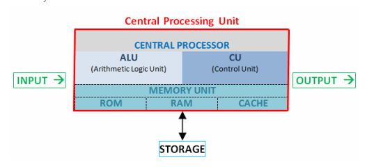

# CPU

CPU : Merupakan singkatan dari central processing unit, atau bisa didefinisikan sebagai pusat pemrosesan.

## Komponen Computer

Berikut daftar komponen CPU beserta fungsinya :

1. Casing : Wadah untuk melindungi dan meletakkan komponen - komponen cpu.
2. Motherboard : Media penghubung untuk setiap komponen komputer agar dapat saling melakukan komunikasi. Inti dari motherboard yaitu :
    
    * Processor
    * Soundcard
    * Videocard
    * Harddisk
    * Dll

3. Processor : Tempat memproses seluruh perintah.

4. Kipas Processor : Menjaga suhu processor tetap dingin dan stabil.

5. RAM : Rando Access Memory, bekerja sebagai tempat menampung data sementara yang telah diproses processor sebelum diteruskan ke komponen lainnya.

6. HDD : Harddisk Drive, berfungsi menyimpan berbagai data dan juga menyimpan berbagai sistem operasi dari suatu perangkat komputer.

7. CD/DVD ROM : Optical disk drive, perangkat yang dapat digunakan untuk menulis dan membaca kaset atau kepingan CD/DVD. Walaupun dijaman sekarang sudah jarang sekali perangkat komputer yang menggunakan ini.

8. VGA Card : Video Graphic Adapter, berfungsi sebagai pengolah data grafis sebelum ditampilkan ke perangkat monitor juga menentukan kualitas gambar yang ditampilkan.

9. soundcard : Berfungsi sebagai pengolah audio untuk perangkat komputer anda, atau bisa diartikan sang processor audio, yang mana dapat mengubah sinyal analog/digital ke dalam kartu, dan menghasilkan suara untuk komputer anda.

10. Power Supply : Untuk membagi daya (listrik) yang masuk pada setiap komponen - komponen komputer serta merubah tegangan dari DC ke AC.

11. Monitor : Menampilkan output berupa tampilan, gambar dan video atau proses yang sedang di input.

12. Mouse : Mengeksekusi perintah (input) sederhana seperti klik kanan, kiri dan scroll.

13. Keyboard : Mengeksekusi perintah (input) menengah seperti mengetik sebuah kata atau code pemrograman, serta shorcut umum pada computer.

14. Speaker : Menampilkan output sederhana berupa suara.

## Perbedaan FAT16, FAT32, NTFS, EXT2, EXT3, EXT4

* FAT16 (File allocation table):
    - Kompatibel disegala OS.
    - mempunyai kapasitas tetap jumlah cluster.
    - tidak mendukung kompresi, enkripsi dan kontrol akses dalam partisi

* FAT32 :
    - menmapung jumlah cluster lebih besar.
    - tidak kompetibel disegala OS.

* NTFS (New technology file system):
    - pembaharuan security.
    - mampu melakukan kompresi file, cluster, dan enkripsi data.

* EXT2 (Extended):
    - file data disimpan pada data blok.
    - mengasosiasikan file dengan struktur data inode.

* EXT3 : 
    - adanya jurnal agar tidak perlu melakukan pengecekan setelah gagal sistem.
    - integritas data setelah terjadi _unclean shutdown_.
    - lebih cepat.
    - Mudah untuk migrasi

* EXT4 :
    - Lebih baik dari segala aspek dari versi sebelumnya.

## Fungsi Partisi

Partisi sendiri memiliki arti pembagian, pembagian alokasi data sesuai struktur dan fungsi yang ditentukan.

contoh :

Pada windows terdapat disk C dan D. dimana disk C dipergunakan untuk system dan menginstall berbagai aplikasi, dan D untuk menyimpan data berupa file dokumen, foto, video dan suara.