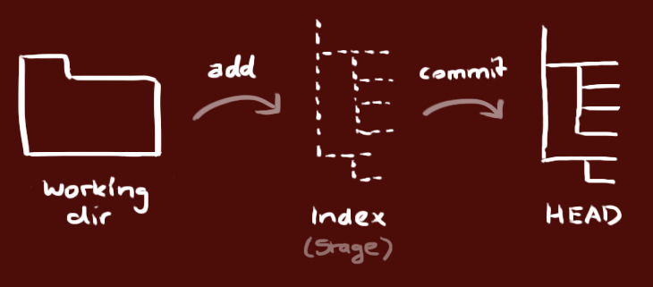

# Home work 1 (06-02-03)

## Membuat catatan markdown dengan menarik dan mudah untuk dibaca.

source : [link](http://rogerdudler.github.io/git-guide/)

# Panduan Singkat Pakai Git

## 1. **Setup**

* Pilih git installer sesuai OS yang dipakai
    > * [OSX/Mac](http://git-scm.com/download/mac)
    > * [Windows](http://msysgit.github.io/)
    > * [Lnux](http://git-scm.com/book/en/Getting-Started-Installing-Git)

## 2. **Membuat Repository Baru**

1. Buat directory baru, buka, jalanin di bash/terminal, ketik : 
    >`git init` 
    ```
    untuk membuat git repository baru
    ```
## 3. **Checkout Repository**

1. Membuat salinan repository, ketik :
    > `git clone /path/to/repository`
    ```
    saat menggunakan remote server, ketik :
    ```
    > `git clone username@host: /path/to/repository`

## 4. **Workflow**

Repository kita terdiri dari 3 *trees* dan dikelola oleh *git*.

1. Yang pertama adalah **`working directory`**, yaitu tahapan **add**. 
>_`Dimana sih kita bekerja atau menyimpan apa yang kita kerjakan?`_ Nah, di **working directory** ini tempatnya. 
2. Yang kedua adalah **`index`**, dan merupakan tahapan **stage**.
>_`Lalu apa tahapan selanjutnya?`_   
File yang kita kerjakan kita masukan ke tahap persiapan, dimana file tersebut sudah siap nih untuk diserah-terimakan, dan **index** merupakan tempatnya. 
3. Yang terakhir adalah **`head`**, merupakan tahapan **commit**.
>_`Sudah siap unjuk gigi?`_  
Sudah, tapi tunggu dulu. Disini lah tempatnya, Dimana kita telah melakukan pekerjaan kita, lalu menyusun pekerjakan yang telah kita kerjakan, nah sekarang adalah tahap serah-terima, dimana tahapan ini disebut **head**.

```
Analogi saya adalah seperti saat kita siap untuk ikut dalam lomba, melakukan olah fisik, mendaftar, dan mengikuti perlombaan. Mudah - mudahan gak salah yah.
```



## 4. Add & Commit

* Jika ada perubahan atau pembaharuan (tambahkan ke dalam tahapan **index**), Ketik :

> `git add <namafile>`

> `git add .`

* Ini merupakan tahapan awal untuk memastikan bahwa git bekerja. Selanjutnya, Simpan perubahan ini dengan mengetikkan :

> `git commit -m 'checkpoint'`

* Sekarang, file yang kita rubah telah tersimpan pada tahap **head**, tapi belum pada _remote repository_ milik kita.

## 5. Pushing Changes

* File yang sudah disimpan pada tahapan **head**, kita kirimkan ke dalam _remote repository_, Ketik :

> `git push origin master`

* Rubah _`master`_ ke branch yang kamu inginkan untuk mengirim file yang disiapkan pada tahap **`index`**.

* jika kamu tidak melakukan _`action cloned an existing repository`_ dan ingin menghubungkan _repository_ milik kita dengan _remote server_, kamu perlu menambahkan dengan mengetik :

> `git remote add origin <server>`

* Sekarang, kamu dapat mengirim perubahan yang telah dilakukan ke _`selected remote server`_.

## 6. Branching

* **`Branching`** : _Branch_, yang dalam bahasa indonesia berarti cabang. _`Branching`_ merupakan pencabangan yang digunakan untuk _mendevelop fiture_ terisolasi satu sama lain. _Master Branch_ adalah si _default_ saat kamu membuat _repository_. Gunakan cabang lain untuk mendevelop, dan gabungkan kembali ke _master branch_ setelah selesai.


```
Buat branch baru dengan nama "feature_x" dan untuk memakai lakukan switch, ketik :
```
> `git checkout -b feature_x`

```
switch kembali ke master branch
```
> `git checkout master`
```
dan delete branch nya lagi
```
> `git branch -d feature_x`

```
Branch tidak tersedia untuk yg lain (not available to others) kecuali kalau kamu push ke branch pada repository milik kita.
```
> `git push origin <branch>`

## 7. Update & Merge

* Untuk mengupdate *local repository* milik kita ke *commit* terbaru, ketik :

> `git pull`

di _working directory_ untuk *fetch* dan *merge remote changes*.

* Untuk menggabungkan _branch_ lainnya ke _branch_ milik kita (e.g master), gunakan :

> `git merge <branch>`

* di beberapa kasus _git_ mencoba meng-_auto-merge_ perubahan. Sayangnya, ini tidak selalu memungkinkan dan mengakibatkan konflik. Kamu bertanggungjawab untuk mem-_merge_ konflik tersebut secara manual dengan mengedit file yang ditampilkan oleh _git_. Setelah diubah, kamu harus menandai perubahan tersebut dengan mem-_merge_ dengan mengetik :

> `git add <filename>`

* sebelum _merging_ diubah, kamu bisa melihat _preview_ dengan menggunakan 

> `git diff <source_branch> <target_branch>`

## 8. Tagging

**_`Tagging`_** direkomendasikan untuk membuat _tag_ untuk _software release_. Konsep ini diketahui sudah ada di **`SVN`**. Kamu bisa membuat _tag_ baru dengan nama 1.0.0 dengan meng-eksekusi

>`git tag 1.0.0 1b2e1d63ff`

**1b2e1d63ff** ditetapkan sebagai 10 karakter pertama dari _commit id_ yang kamu inginkan sebagai referensi dengan _tag_ mu. Kamu bisa mendapatkan _commit id_ dengan meilhatnya.

## 9. Log

Dalam situasi sederhana, kamu bisa mempelajari _history repository_ menggunakan :

>`git log`

Kamu bisa menambahkan banyak parameter untuk membuat tampilan log seperti yang kamu inginkan. Untuk meilhat _commit_ dari penulis, ketik :

>`git log --author=bob`

Untuk meilhat _compressed log_ dimana setiap _commit_ ada pada satu line :

>`git log --pretty=oneline`

Atau mungkin kamu ingin melihat sebuah **`ASCII`** _art tree_ dari seluruh _branch_, hias dengan nama dari _tag_ dan _branch_ :

>`git log --name-status`

Hanya beberapa parameter yang mungkin dapat anda gunakan, untuk lebih lanjut dapat dilihat di :

>`git log --help`

## 10. Replace Local Changes

Terkadang kamu membuat sebuah kesalahan, untuk memastikan ini tak akan terjadi, kamu bisa mengganti _local changes_ menggunakan command

>`git checkout -- <filename>`

Ini mengganti perubahan di dalam _working tree_ dengan _last content_ di *HEAD*. Perubahan siap ditambahkan ke dalam _index_, sebagai file baru, dan akan disimpan.

Jika ingin menaruh seluruh perubahan dan _local commit_, ambil history terbaru dari server dan arahkan _branch master local_ ke sana seeperti ini :

>`git fetch origin`
>`git reset --hard origin/master`

## 11. Useful Hints

_Built-in git GUI_

>`gitk`

_colorful git output_

>`git config color.ui true`

menampilkan log hanya dalam satu line tiap _commit_

>`git config format.pretty oneline`

menggunakan _`adding`_ interaktif

>`git add -i`

### Link & Resources

* Graphical Clients

    [GitX (L)(OSX, Open source)](http://gitx.laullon.com/)

    [Tower (OSX)](http://www.git-tower.com/)

    [Source Tree (OSX & Windows, free)](http://www.sourcetreeapp.com/)

    [Github for Mac (OSX, Free)](http://mac.github.com/)

    [GitBox (OSX, App Store)](https://itunes.apple.com/gb/app/gitbox/id403388357?mt=12)

* Guides

    [Git Community Book](http://book.git-scm.com/)

    [Pro Kit](http://progit.org/book/)

    [Think like a git](http://think-like-a-git.net/)

    [Github Help](http://help.github.com/)

    [A visual Git guide](http://marklodato.github.com/visual-git-guide/index-en.html)

* Get Help

    [Git user mailing list](http://groups.google.com/group/git-users/)

    [#git on irc.freenode.net](http://jk.gs/git/)