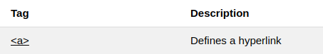
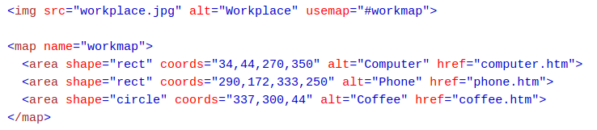
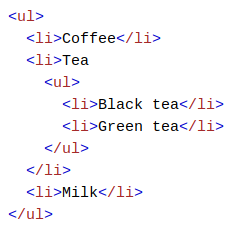

# HTML Style - CSS


## Ber-HTML dengan gaya dengan CSS

**CSS** merupakan singkatan dari _Cascading Style Sheets_.
**CSS** mendeskripsikan bagaimana elemen HTML ditampilkan pada layar, kertas, atau media lainnya.
**CSS** menghemat banyak pekerjaan. Dapat mengontrol tata letak beberapa halaman web sekaligus.
**CSS** dapat ditambahkan ke elemen HTML dalam 3 cara:
- Inline : dengan menggunakan atribut style dalam elemen HTML.

- Internal : dengan menggunakan elemen < style > dibagian < head >.

- External : dengan menggunakan file CSS.


## CSS Fonts

Properti warna CSS menentukan warna teks yang akan digunakan. Properti font-family CSS mendefinisikan font yang akan digunakan. Properti ukuran font CSS menentukan ukuran teks yang akan digunakan.


## CSS Border

Properti perbatasan CSS menetapkan batas di sekitar elemen HTML:


## CSS Padding

Properti padding CSS mendefinisikan _padding_ (spasi) antara teks dan perbatasan:


## CSS Margin

Properti _margin_ CSS mendefinisikan margin (spasi) di luar perbatasan:


## Atribut id

Untuk menentukan gaya spesifik untuk satu elemen khusus, tambahkan atribut id ke elemen:


lalu tentukan gaya untuk elemen dengan id spesifik:


> Catatan: Id suatu elemen harus unik di dalam halaman, jadi pemilih id digunakan untuk memilih satu elemen unik!

## Atribut Class

Untuk menentukan gaya untuk jenis elemen khusus, tambahkan atribut _class_ ke elemen:


kemudian tentukan gaya untuk elemen dengan kelas spesifik:


## Referensi External

_External style sheet_ dapat dirujuk dengan URL lengkap atau dengan path relatif ke halaman web saat ini. Contoh ini menggunakan URL lengkap untuk menautkan ke style sheet:


Contoh ini menghubungkan ke style sheet yang terletak di folder html di situs web saat ini:


Contoh ini menautkan ke lembar gaya yang terletak di folder yang sama dengan halaman saat ini:


## Tag HTML Style


# Link HTML

Tautan ditemukan di hampir semua halaman web. Tautan memungkinkan pengguna mengeklik jalannya dari halaman ke halaman.

## Link HTML - Hyperlinks

Tautan HTML adalah hyperlink. Anda dapat mengklik tautan dan melompat ke dokumen lain. Saat Anda memindahkan mouse di atas tautan, panah mouse akan berubah menjadi tangan kecil.

> Catatan: Tautan tidak harus berupa teks. Ini bisa berupa gambar atau elemen HTML lainnya.

## Link HTML - Syntax

Hyperlink didefinisikan dengan tag HTML < a >:


> Catatan: Tanpa garis miring di akhir alamat subfolder, Anda dapat menghasilkan dua permintaan ke server. Banyak server akan secara otomatis menambahkan garis miring ke akhir alamat, dan kemudian membuat permintaan baru.

## Link HTML - Atribut target

Atribut target menentukan tempat untuk membuka dokumen yang ditautkan. Atribut target dapat memiliki salah satu dari nilai berikut:
- _blank - Membuka dokumen yang ditautkan di jendela atau tab baru.
- _self - Membuka dokumen yang ditautkan di jendela / tab yang sama dengan yang diklik (ini default).
- _parent - Membuka dokumen yang ditautkan dalam bingkai induk.
- _top - Membuka dokumen yang ditautkan di seluruh jendela.
- framename - Membuka dokumen yang ditautkan dalam bingkai bernama.

Contoh ini akan membuka dokumen yang ditautkan di jendela / tab browser baru:


> Tip: Jika halaman web Anda terkunci dalam sebuah bingkai, Anda dapat menggunakan target = "_ top" untuk keluar dari bingkai:


## Link HTML - Image sebagai link

Adalah umum untuk menggunakan gambar sebagai tautan:

> Catatan: border: 0; ditambahkan untuk mencegah IE9 (dan sebelumnya) menampilkan batas di sekitar gambar (ketika gambar adalah tautan).

## Tombol sebagai link

Untuk menggunakan tombol HTML sebagai tautan, Anda harus menambahkan beberapa kode JavaScript. JavaScript memungkinkan Anda menentukan apa yang terjadi di acara-acara tertentu, seperti klik tombol:


## Judul Link

Atribut title menentukan informasi tambahan tentang suatu elemen. Informasi ini paling sering ditampilkan sebagai teks tooltip ketika mouse bergerak di atas elemen.


## Jalur External

Halaman external dapat dirujuk dengan URL lengkap atau dengan jalur relatif ke halaman web saat ini. Contoh ini menggunakan URL lengkap untuk menautkan ke halaman web:


Contoh ini menghubungkan ke halaman yang terletak di folder html di situs web saat ini:


Contoh ini menghubungkan ke halaman yang berada di folder yang sama dengan halaman saat ini:


## Tag Link HTML


# Warna link HTML

## Warna link HTML

Secara default, sebuah tautan akan muncul seperti ini (di semua browser):

- Tautan yang belum dikunjungi digarisbawahi dan berwarna biru
- Tautan yang dikunjungi digarisbawahi dan berwarna ungu
- Tautan aktif digarisbawahi dan merah

Anda dapat mengubah warna default, dengan menggunakan CSS:


## Tombol Link

Tautan juga dapat ditata sebagai tombol, dengan menggunakan CSS:


## Tag link HTML



# Bookmark link 

## Link HTML - Membuat Bookmark

Bookmark HTML digunakan untuk memungkinkan pembaca melompat ke bagian tertentu dari halaman Web.

Bookmark dapat bermanfaat jika halaman web sangat panjang.

Untuk membuat bookmark - pertama buat bookmark, lalu tambahkan tautan ke sana.

Ketika tautan diklik, halaman akan menggulir ke bawah atau ke atas ke lokasi dengan bookmark.

Pertama, buat bookmark dengan atribut id:


Kemudian, tambahkan tautan ke bookmark ("Lompat ke Bab 4"), dari dalam halaman yang sama:


Anda juga dapat menambahkan tautan ke bookmark di halaman lain:


## Tag Link HTML


# Gambar HTML

Gambar dapat meningkatkan desain dan tampilan halaman web.


## Syntax Gambar HTML

Dalam HTML, gambar didefinisikan dengan tag < img >. Tag < img > kosong, hanya berisi atribut, dan tidak memiliki tag penutup. Atribut src menentukan URL (alamat web) dari gambar:


## Atribut Alt

Atribut alt menyediakan teks alternatif untuk gambar, jika pengguna karena alasan tertentu tidak dapat melihatnya (karena koneksi lambat, kesalahan dalam atribut src, atau jika pengguna menggunakan pembaca layar).


Jika browser tidak dapat menemukan gambar, itu akan menampilkan nilai atribut alt:


> Catatan: Atribut alt diperlukan. Halaman web tidak akan divalidasi dengan benar tanpa itu.

## Ukuran Gambar - Lebar dan Tinggi

Anda dapat menggunakan atribut style untuk menentukan lebar dan tinggi gambar.


Atau, Anda dapat menggunakan atribut lebar dan tinggi:


Atribut lebar dan tinggi selalu menentukan lebar dan tinggi gambar dalam piksel.

> Catatan: Selalu tentukan lebar dan tinggi gambar. Jika lebar dan tinggi tidak ditentukan, halaman mungkin akan berkedip saat gambar dimuat.

## Lebar dan Tinggi, atau Style ?

Atribut lebar, tinggi, dan style valid dalam HTML.

Namun, kami menyarankan untuk menggunakan atribut style. Ini mencegah style sheet mengubah ukuran gambar:


## Gambar pada file lain

Jika tidak ditentukan, peramban mengharapkan untuk menemukan gambar dalam folder yang sama dengan halaman web.

Namun, itu biasa untuk menyimpan gambar dalam sub-folder. Anda kemudian harus memasukkan nama folder dalam atribut src:


## Gambar pada server lain

Beberapa situs web menyimpan gambar mereka di server gambar. Sebenarnya, Anda dapat mengakses gambar dari alamat web mana pun di dunia:


## Gambar Animasi

HTML memungkinkan GIF animasi:


## Gambar sebagai link

Untuk menggunakan gambar sebagai tautan, masukkan tag < img > di dalam tag < a >:


> Catatan: perbatasan: 0; ditambahkan untuk mencegah IE9 (dan sebelumnya) menampilkan batas di sekitar gambar (ketika gambar adalah tautan).

## Gambar floating

Gunakan properti float CSS untuk membiarkan gambar melayang ke kanan atau ke kiri teks:


## Tag Gambar HTML


# Peta gambar HTML

Dengan peta gambar, Anda dapat menambahkan area yang dapat diklik pada gambar.
Tag < map > mendefinisikan peta-gambar. Peta-gambar adalah gambar dengan area yang dapat diklik. Klik pada komputer, telepon, atau secangkir kopi pada gambar di bawah ini:




## Gambar

Gambar dimasukkan menggunakan tag < img >. Satu-satunya perbedaan dari gambar lain adalah Anda harus menambahkan atribut usemap:


Nilai usemap dimulai dengan tag hash # diikuti dengan nama peta gambar, dan digunakan untuk membuat hubungan antara gambar dan peta gambar.

> Catatan: Anda dapat menggunakan gambar apa saja sebagai peta gambar.

# Peta

Kemudian tambahkan elemen < map >. Elemen < map > digunakan untuk membuat peta gambar, dan ditautkan ke gambar dengan menggunakan atribut nama:


Atribut nama harus memiliki nilai yang sama dengan atribut usemap.

> Catatan: Anda dapat memasukkan elemen < map > di mana saja Anda suka, itu tidak harus dimasukkan tepat setelah gambar.

## Area 

Kemudian tambahkan area yang dapat diklik. Area yang dapat diklik ditentukan menggunakan elemen < area >.

### Shape

Anda harus menentukan bentuk area, dan Anda dapat memilih salah satu dari nilai-nilai ini:

- rect - mendefinisikan wilayah persegi panjang
- lingkaran - mendefinisikan wilayah lingkaran
- poli - mendefinisikan suatu wilayah poligon
- default - mendefinisikan seluruh wilayah

## Koordinat

Anda harus menetapkan beberapa koordinat untuk dapat menempatkan area yang dapat diklik ke gambar. Koordinat datang berpasangan, satu untuk sumbu x dan satu untuk sumbu y. Koordinat 34, 44 terletak 34 piksel dari margin kiri dan 44 piksel dari atas:


Koordinat 270, 350 terletak 270 piksel dari margin kiri dan 350 piksel dari atas:


Sekarang Anda memiliki cukup data untuk membuat area persegi panjang yang dapat diklik:


Ini adalah area yang dapat diklik dan akan mengirim pengguna ke halaman computer.htm:


## Lingkaran

Untuk menambahkan area lingkaran, cari terlebih dahulu koordinat pusat lingkaran: 337, 300


Kemudian tentukan jari-jari lingkaran: 44 piksel


Sekarang Anda memiliki cukup data untuk membuat area melingkar yang dapat diklik:


Ini adalah area yang dapat diklik dan akan mengirim pengguna ke halaman coffee.htm:


## Peta Gambar dan Javascript

Area yang dapat diklik tidak harus berupa tautan ke halaman lain, tetapi juga dapat memicu fungsi JavaScript. Tambahkan acara klik pada elemen < area > untuk menjalankan fungsi JavaScript:

Anda dapat menggunakan atribut onclick untuk menjalankan fungsi JavaScript saat area diklik


# Gambar Background HTML


Untuk menambahkan gambar latar belakang dalam HTML, gunakan properti-gambar latar CSS.

## Gambar Background pada elemen HTML

Untuk menambahkan gambar latar belakang pada elemen HTML, Anda dapat menggunakan atribut style:
Untuk menambahkan gambar latar belakang pada elemen HTML, Anda dapat menggunakan atribut style:

Tambahkan gambar latar belakang pada elemen HTML:


Anda juga dapat menentukan gambar latar belakang di elemen < style >:

Tentukan gambar latar belakang di elemen style:


## Gambar Background pada halaman

Jika Anda ingin seluruh halaman memiliki gambar latar belakang, maka Anda harus menentukan gambar latar belakang pada elemen < body >:

Tambahkan gambar latar belakang pada halaman HTML:


## Mengulang Background

Jika gambar latar belakang lebih kecil dari elemen, gambar akan berulang dengan sendirinya, secara horizontal dan vertikal, hingga mencapai akhir elemen. Untuk menjelaskan, lihat apa yang terjadi ketika kita menggunakan gambar kecil sebagai latar belakang di dalam elemen div besar:


Properti background-image akan mencoba untuk mengisi elemen div dengan gambar sampai mencapai akhir.


Untuk menghindari gambar latar belakang terulang, gunakan properti pengulangan latar belakang.


## Sampul Background

Jika Anda ingin gambar latar belakang menutupi seluruh elemen, Anda dapat mengatur properti ukuran latar belakang untuk cover. Juga, untuk memastikan seluruh elemen selalu tertutup, setel properti lampiran latar belakang menjadi tetap:


Seperti yang Anda lihat, gambar akan menutupi seluruh elemen, tanpa peregangan, gambar akan mempertahankan proporsi aslinya.


## Background Stretch

Jika Anda ingin peregangan gambar latar belakang agar sesuai dengan seluruh gambar dalam elemen, Anda dapat mengatur properti ukuran latar belakang menjadi 100% 100%:


# Elemen Gambar HTML

Elemen gambar memungkinkan kita untuk menampilkan gambar yang berbeda untuk perangkat atau ukuran layar yang berbeda.


## Elemen < picture > HTML

HTML5 memperkenalkan elemen < picture > untuk menambahkan lebih banyak fleksibilitas saat menentukan sumber daya gambar. Elemen < picture > berisi sejumlah elemen < source >, masing-masing merujuk ke sumber gambar yang berbeda. Dengan cara ini browser dapat memilih gambar yang paling sesuai dengan tampilan dan / atau perangkat saat ini.


> Catatan: Selalu tentukan elemen < img > sebagai elemen turunan terakhir dari elemen < picture >. Elemen < img > digunakan oleh browser yang tidak mendukung elemen < picture >, atau jika tidak ada tag < source > yang cocok.

Ada dua tujuan utama untuk elemen < picture >:

1. Bandwith

Jika Anda memiliki layar atau perangkat kecil, tidak perlu memuat file gambar besar. Browser akan menggunakan elemen < source > pertama dengan nilai atribut yang cocok, dan mengabaikan elemen-elemen berikut.

2. Format Support

Beberapa browser atau perangkat mungkin tidak mendukung semua format gambar. Dengan menggunakan elemen < picture >, Anda dapat menambahkan gambar dari semua format, dan browser akan menggunakan format pertama yang dikenali dan mengabaikan salah satu dari berikut ini.


> Catatan: Browser akan menggunakan elemen < source > pertama dengan nilai atribut yang cocok, dan mengabaikan elemen < source > berikut.

# HTML Tables


## Mendifiniskan Tabel HTML

Tabel HTML didefinisikan dengan tag < table >. Setiap baris tabel ditentukan dengan tag < tr >. Header tabel didefinisikan dengan tag < th >. Secara default, judul tabel tebal dan terpusat. Data tabel / sel didefinisikan dengan tag < td >.


> Catatan: Elemen < td > adalah wadah data tabel. Mereka dapat berisi segala macam elemen HTML; teks, gambar, daftar, tabel lain, dll.

## Tabel HTML - Menambahkan Border

Jika Anda tidak menentukan batas untuk tabel, itu akan ditampilkan tanpa batas. Perbatasan diatur menggunakan properti perbatasan CSS:


> Ingatlah untuk mendefinisikan batas untuk sel tabel dan tabel.

## Tabel HTML - Batas Batas

Jika Anda ingin perbatasan runtuh menjadi satu perbatasan, tambahkan properti CSS border-collapse:

## Tabel HTML - Menambahkan Padding Sel

Padding sel menentukan ruang antara konten sel dan batasnya. Jika Anda tidak menentukan padding, sel-sel tabel akan ditampilkan tanpa padding. Untuk mengatur padding, gunakan properti padding CSS:


## Tabel HTML - Judul rata kiri

Secara default, judul tabel tebal dan terpusat. Untuk menyelaraskan kiri judul tabel, gunakan properti text-align CSS:


## Tabel HTML - Menambahkan Spasi Perbatasan

Border spacing menentukan ruang antar sel. Untuk mengatur spasi perbatasan untuk tabel, gunakan properti border-spacing CSS:


> Catatan: Jika tabel memiliki batas tepian yang runtuh, border-spacing tidak berpengaruh.

## Tabel HTML - Sel yang Rentang Banyak Kolom

Untuk membuat rentang sel lebih dari satu kolom, gunakan atribut colspan:


## Tabel HTML - Sel yang Rentang Banyak Baris

Untuk membuat rentang sel lebih dari satu baris, gunakan atribut rowspan:


## Tabel HTML - Menambahkan Keterangan

Untuk menambahkan keterangan ke tabel, gunakan tag < caption >:


> Catatan: Tag < caption > harus dimasukkan segera setelah tag < table >.

## Gaya Khusus untuk Satu Table

Untuk menentukan gaya khusus untuk tabel khusus, tambahkan atribut id ke tabel:


Sekarang Anda dapat menentukan gaya khusus untuk tabel ini:


Dan tambahkan lebih banyak gaya:


Tag Tabel HTML


# List HTML

## Contoh List HTML


## Unordered list HTML

Daftar yang tidak berurutan dimulai dengan tag < ul >. Setiap item daftar dimulai dengan tag < li >. Item daftar akan ditandai dengan peluru (lingkaran hitam kecil) secara default:


## Unordered List HTML - Pilih Penanda Item Daftar

Properti list-style-type CSS digunakan untuk menentukan gaya penanda item daftar:


Contoh - Disc


Contoh - Circle


Contoh - Square


Contoh - None


## Daftar HTML yang Diorder

Daftar yang diurutkan dimulai dengan tag < ol >. Setiap item daftar dimulai dengan tag < li >. Item daftar akan ditandai dengan angka secara default:


## Daftar HTML yang Diorder - Jenis Atribut

The type attribute of the < ol > tag, defines the type of the list item marker:


Nomor :


Huruf Besar : 


Huruf Kecil :


Huruf Romawi Besar :


Huruf Romawi Kecil :


## List Deskripsi HTML

HTML juga mendukung daftar deskripsi. Daftar deskripsi adalah daftar istilah, dengan deskripsi setiap istilah. Tag < dl > mendefinisikan daftar deskripsi, tag < dt > mendefinisikan istilah (nama), dan tag < dd > menjelaskan setiap istilah:


## Nested HTML List

Daftar dapat disarangkan (daftar di dalam daftar):



> Catatan: Item daftar dapat berisi daftar baru, dan elemen HTML lainnya, seperti gambar dan tautan, dll.

## Penghitungan Daftar Kontrol

Secara default, daftar yang dipesan akan mulai menghitung dari 1. Jika Anda ingin mulai menghitung dari nomor yang ditentukan, Anda dapat menggunakan atribut mulai:


## List Horizontal dengan CSS

Daftar HTML dapat ditata dengan berbagai cara dengan CSS. Salah satu cara populer adalah mendesain daftar secara horizontal, untuk membuat menu navigasi:


## List Tag HTML


# Blok HTML dan Elemen Sebaris

Setiap elemen HTML memiliki nilai tampilan default tergantung pada jenis elemen apa itu. Dua nilai tampilan adalah: blok dan sebaris.

## Elemen Tingkat Blok

Elemen level blok selalu dimulai pada garis baru dan mengambil lebar penuh yang tersedia (membentang ke kiri dan kanan sejauh mungkin).

```
Elemen <div> adalah elemen level blok.
```


Blokir elemen level dalam HTML:


## Elemen Sebaris

Elemen inline tidak dimulai pada baris baru dan hanya membutuhkan lebar sebanyak yang diperlukan.

Ini adalah elemen < span > sebaris di dalam paragraf.


Elemen sebaris dalam HTML:


## Elemen < div >
Elemen < div > sering digunakan sebagai wadah untuk elemen HTML lainnya. Elemen < div > tidak memiliki atribut yang diperlukan, tetapi gaya, kelas, dan id adalah umum. Saat digunakan bersama dengan CSS, elemen < div > dapat digunakan untuk menata blok konten:


## Elemen < span >
Elemen < span > sering digunakan sebagai wadah untuk beberapa teks. Elemen < span > tidak memiliki atribut yang diperlukan, tetapi gaya, kelas, dan id adalah umum. Saat digunakan bersama dengan CSS, elemen < span > dapat digunakan untuk menata bagian teks:


## Pengelompokan Tag HTML


# Atribut Class HTML

## Menggunakan Atribut Class

Atribut kelas HTML digunakan untuk mendefinisikan gaya yang sama untuk elemen dengan nama kelas yang sama. Jadi, semua elemen HTML dengan atribut kelas yang sama akan mendapatkan gaya yang sama. Di sini kita memiliki tiga elemen < div > yang menunjuk ke nama kelas yang sama:


Hasil :


## Menggunakan Atribut kelas pada Elemen Inline

Atribut kelas HTML juga dapat digunakan pada elemen sebaris:


> Tip: Atribut class dapat digunakan pada elemen HTML apa pun.

> Catatan: Nama class peka huruf besar kecil!

## Pilih Elemen Dengan Class Tertentu

Dalam CSS, untuk memilih elemen dengan kelas tertentu, tulis karakter titik (.), Diikuti dengan nama kelas:

Use CSS to style all elements with the class name "city":


Hasil : 


## Multiple Class

Elemen HTML dapat memiliki lebih dari satu nama class, setiap nama class harus dipisahkan oleh spasi.

Elemen style dengan nama class "kota", juga elemen style dengan nama class "utama":


Dalam contoh di atas, elemen < h2 > pertama milik class "kota" dan class "utama".

## Tag yang Berbeda Dapat Membagikan Class yang Sama

Tag yang berbeda, seperti < h2 > dan < p >, dapat memiliki nama class yang sama dan karenanya berbagi style yang sama:


## Menggunakan Atribut Class dalam JavaScript

Nama class juga dapat digunakan oleh JavaScript untuk melakukan tugas tertentu untuk elemen dengan nama class yang ditentukan. JavaScript dapat mengakses elemen dengan nama class yang ditentukan dengan menggunakan metode getElementsByClassName ():


# Atribut id HTML

## Menggunakan Atribut id

Atribut id menentukan id unik untuk elemen HTML (nilainya harus unik dalam dokumen HTML). Nilai id dapat digunakan oleh CSS dan JavaScript untuk melakukan tugas tertentu untuk elemen dengan nilai id tertentu. Di CSS, untuk memilih elemen dengan id tertentu, tulis karakter hash (#), diikuti oleh id elemen:

Gunakan CSS untuk menata elemen dengan id "myHeader":


Hasil :


> Tip: Atribut id dapat digunakan pada elemen HTML apa pun.
> Catatan: Nilai id peka huruf besar-kecil.
> Catatan: Nilai id harus mengandung setidaknya satu karakter, dan tidak boleh mengandung spasi putih (spasi, tab, dll.).

## Perbedaan Antara Class dan id

Elemen HTML hanya dapat memiliki satu id unik yang dimiliki oleh elemen tunggal itu, sementara nama class dapat digunakan oleh banyak elemen:


## Bookmarks dengan id dan links

Bookmark HTML digunakan untuk memungkinkan pembaca melompat ke bagian tertentu dari halaman Web. Bookmark dapat bermanfaat jika halaman web Anda sangat panjang. Untuk membuat bookmark, Anda harus terlebih dahulu membuat bookmark, dan kemudian menambahkan tautan. Ketika tautan diklik, halaman akan menggulir ke lokasi dengan bookmark.

Contoh :

Pertama, buat bookmark dengan atribut id:


Kemudian, tambahkan tautan ke bookmark ("Lompat ke Bab 4"), dari dalam halaman yang sama:


Atau, tambahkan tautan ke bookmark ("Lompat ke Bab 4"), dari halaman lain:


## Menggunakan Atribut id pada javaScript

JavaScript dapat mengakses elemen dengan id yang ditentukan dengan menggunakan metode getElementById ():

Gunakan atribut id untuk memanipulasi teks dengan JavaScript:


## Iframes HTML

Iframe digunakan untuk menampilkan halaman web di dalam halaman web.


## Syntax Iframe

Iframe HTML didefinisikan dengan tag < iframe >:


Atribut src menentukan URL (alamat web) dari halaman bingkai inline.

## Iframe - Set Lebar dan Tinggi

Gunakan atribut tinggi dan lebar untuk menentukan ukuran iframe. Tinggi dan lebar ditentukan dalam piksel secara default:


Atau Anda dapat menggunakan CSS untuk mengatur tinggi dan lebar iframe:


Iframe - Menghilangkan Bingkai

Secara default, iframe memiliki batas di sekitarnya. Untuk menghapus perbatasan, tambahkan atribut style dan gunakan properti perbatasan CSS:


Dengan CSS, Anda juga dapat mengubah ukuran, gaya, dan warna batas iframe:


## Iframe - Target untuk Link

Iframe dapat digunakan sebagai bingkai target untuk tautan. Atribut target tautan harus merujuk ke atribut nama iframe:


## Tag Iframe HTML

