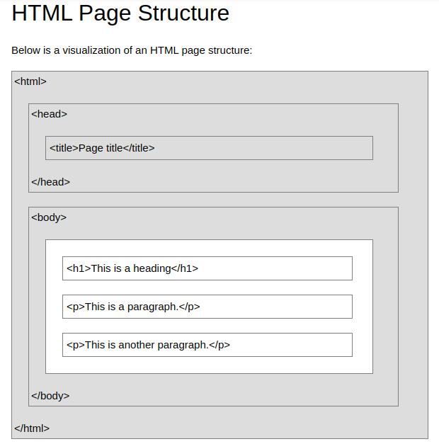
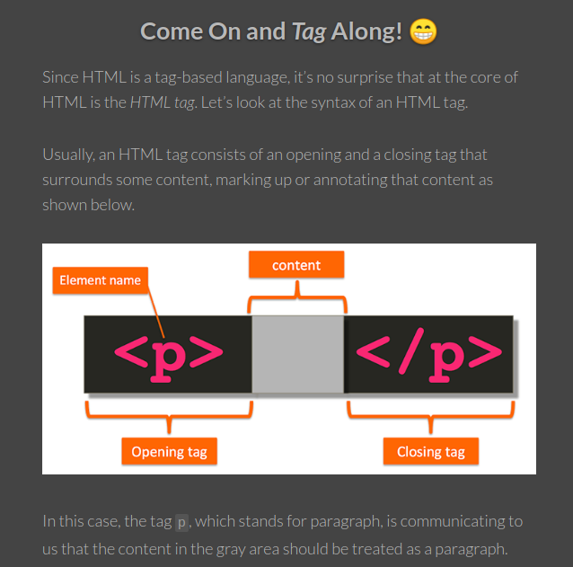

`fn + end / fn + home` untuk ke akhir / awal kalimat
`ctrl + kanan/kiri` untuk ke kata sesudah/sebelum
`ctrl+shift+kanan/kiri` untuk block perkata
`shift+(fn)end` block satu kalimat sampai akhir

struktur syntaax html :
```html
<nama_tag>konten atau isinya</nama_tag>
```
arrangement :


syntax option html
```html
<nama_elemen atribut="isi atribut" atribut_baru="isi atribut baru"> konten atau isinya </nama_elemen>
```


selengkapnya pada [website](https://clearlydecoded.com/anatomy-of-html-tag) ini